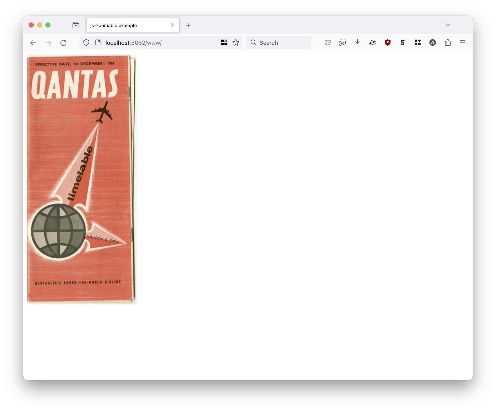
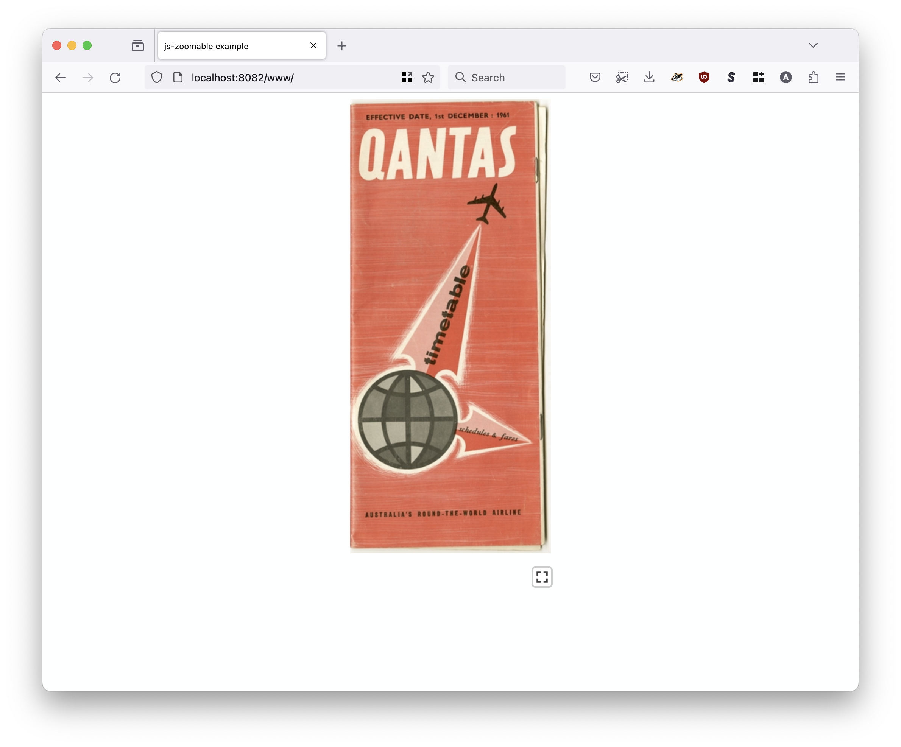
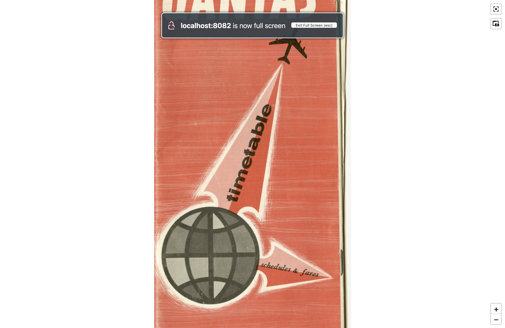

# webcomponent-zoomable-image

A Web Component to extend the HTML `picture` element to enable fullscreen, interactive, IIIF Level 0 "zoomable" image tiles.

This package supersedes the [sfomuseum/js-zoomable-images](https://github.com/sfomuseum/js-zoomable-images) package. For background, please consult the [zoomable.images.js](https://millsfield.sfomuseum.org/blog/2020/09/14/js-zoomable/) blog post.

## Documentation

Documentation is incomplete at this time. Consult the [www](www) folder for working examples.

Source files for the Web Components, and related CSS, are stored in the [src](src) folder. External libraries are kept in the [lib](lib) folder. Bundled distribution files are kept in the [dist](dist) folder and generated using the `dist-all` Makefile target (which depends on [minify](https://github.com/tdewolff/minify) being installed).

```
$> make dist-all
minify --bundle \
		--output dist/zoomable.image.webcomponent.bundle.js \
		lib/leaflet.js \
		lib/leaflet-image.js \
		lib/leaflet.image.control.js \
		lib/leaflet.fullscreen.js \
		lib/leaflet-iiif.js \
		lib/FileSaver.min.js \
		src/zoomable.images.js \
		src/zoomable-image.js
(11.81425ms, 187 kB, 166 kB,  88.6%,  16 MB/s) - (lib/leaflet.js + lib/leaflet-image.js + lib/leaflet.image.control.js + lib/leaflet.fullscreen.js + lib/leaflet-iiif.js + lib/FileSaver.min.js + src/zoomable.images.js + src/zoomable-image.js) to dist/zoomable.image.webcomponent.bundle.js
minify --bundle \
		--output dist/zoomable.image.webcomponent.bundle.css \
		lib/leaflet.css \
		lib/leaflet.fullscreen.css \
		lib/leaflet.image.control.css \
		src/zoomable.images.css
(757.625µs,  49 kB,  42 kB,  85.4%,  64 MB/s) - (lib/leaflet.css + lib/leaflet.fullscreen.css + lib/leaflet.image.control.css + src/zoomable.images.css) to dist/zoomable.image.webcomponent.bundle.css
```

## picture@is="zoomable-image"

Extend `picture` elements to behave like a `zoomable-image` component. This will decorate the `picture` element (and all its children) with markup to display a "fullscreen" button control that, when pressed, will display interactive IIIF Level 0 tiles in fullscreen mode.

### Attributes

| Name | Value | Required | Notes |
| --- | --- | --- | --- |
| is | "zoomable-image" | yes | Declares that the `picture` should behave like a `zoomable-image` Web Component |
| zoomable-image-id | string | yes | A unique identifier for the image. |
| zoomable-tiles-url | string | yes | The parent URI where IIIF (Level 0) tiles for the image are stored. |
| zoomable-image-control | | no | If present this will enable the [sfomuseum/leaflet-image-control](https://github.com/sfomuseum/leaflet-image-control) Leaflet control to allow capturing image crops. | zoomable-loading-image | string | no | If present this image will be set as the background image while loading the image assets defined by the `picture` element. |

### Example

Given the [following markup](www/index.html):

```
<link rel="stylesheet" type="text/css" href="../../dist/zoomable.image.webcomponent.bundle.css" />
<script type="text/javascript" src="../../dist/zoomable.image.webcomponent.bundle.js"></script>

<picture is="zoomable-image" zoomable-image-id="1729566517" zoomable-tiles-url="https://static.sfomuseum.org/media/172/956/651/7/tiles/" zoomable-image-control>
    
</picture>
```

Two things to note:

1. This Web Component works with multiple `picture` elements in a single page.
2. Styles for the Web Component do _not_ need to be defined in an HTML `template` element because it does not use a shadow DOM.

This is what that page would like if the `is="zoomable-image"` attribute is _absent_ or if the `zoomable.image.webcomponent.bundle.js` script is _not_ loaded.



This is what that page would like if the `is="zoomable-image"` attribute is _present_ (and the `zoomable.image.webcomponent.bundle.js` script has been loaded). Note the "fullscreen" button that has been positioned under the image.



And this what the page looks like when that button is pressed.



### CSS

Styling for the markup added by the `zoomable-image` Web Component is defined in the [src/zoomable.images.css](javascript/zoomable.images.css) file.

### JavaScript

The source for `zoomable-image` Web Component is divided in to two files:

* [src/zoomable-image.js](src/zoomable-image.js) defines the code for registering the Web Component and decorating a `picture` element with additional HTML.
* [src/zoomable.images.js](src/zoomable.images.js) defines the code for triggering fullscreen mode and rendering the IIIF (Level 0) image tiles.

## See also

* https://leafletjs.com/
* https://github.com/Leaflet/Leaflet.fullscreen
* https://github.com/mejackreed/Leaflet-IIIF
* https://github.com/sfomuseum/leaflet-image-control
* https://github.com/mapbox/leaflet-image
* https://github.com/eligrey/FileSaver.js
* https://developer.mozilla.org/en-US/docs/Web/API/Web_components