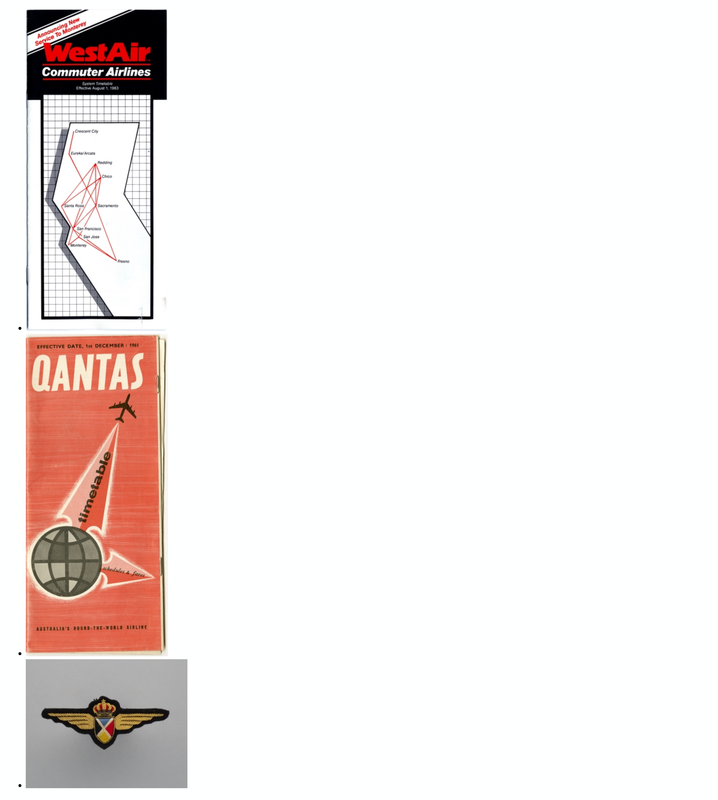
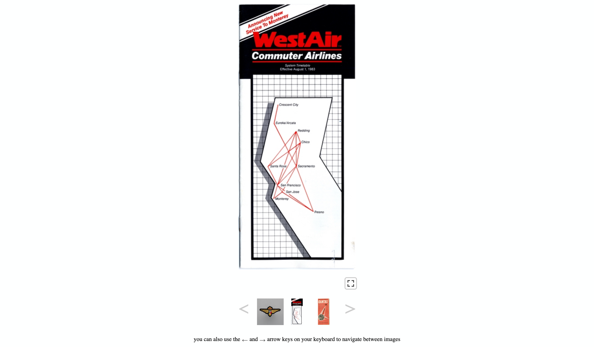

# webcomponent-zoomable-image

A Web Component to extend the HTML `picture` element to enable fullscreen, interactive, [IIIF](https://iiif.io/) Level 0 "zoomable" image tiles.

This package supersedes the [sfomuseum/js-zoomable-images](https://github.com/sfomuseum/js-zoomable-images) package. For background, please consult the [zoomable.images.js](https://millsfield.sfomuseum.org/blog/2020/09/14/js-zoomable/) blog post.

## Important

This package does not produce IIIF Level 0 image tiles. You will need to use something like the `iiif-tile-seed` program (which is part of the [go-iiif](https://github.com/go-iiif/go-iiif#iiif-tile-seed) package) or equivalent to generate tiles and host them somewhere the `zoomable-image` Web Component can access them.

## Documentation

Documentation is incomplete at this time. Consult the [www](www) folder for working examples.

Source files for the Web Components, and related CSS, are stored in the [src](src) folder. External libraries are kept in the [lib](lib) folder. Bundled distribution files are kept in the [dist](dist) folder and generated using the `dist-all` Makefile target (which depends on [minify](https://github.com/tdewolff/minify) being installed).

```
> make dist-all
minify --bundle \
		--output dist/zoomable.image.webcomponent.bundle.js \
		lib/leaflet.js \
		lib/leaflet-image.js \
		lib/leaflet.image.control.js \
		lib/leaflet-iiif.js \
		lib/FileSaver.min.js \
		src/zoomable.leaflet.fullscreen.js \		
		src/zoomable.images.js \
		src/zoomable-image.js \
		src/zoomable-image-carousel.js
(11.289875ms, 200 kB, 173 kB,  86.7%,  18 MB/s) - (lib/leaflet.js + lib/leaflet-image.js + lib/leaflet.image.control.js + lib/leaflet.fullscreen.js + lib/leaflet-iiif.js + lib/FileSaver.min.js + src/zoomable.images.js + src/zoomable-image.js + src/zoomable-image-carousel.js) to dist/zoomable.image.webcomponent.bundle.js
minify --bundle \
		--output dist/zoomable.image.webcomponent.bundle.css \
		lib/leaflet.css \
		lib/leaflet.fullscreen.css \
		lib/leaflet.image.control.css \
		src/zoomable.images.css \
		src/zoomable.carousel.css
(960.625µs,  49 kB,  42 kB,  85.4%,  51 MB/s) - (lib/leaflet.css + lib/leaflet.fullscreen.css + lib/leaflet.image.control.css + src/zoomable.images.css + src/zoomable.carousel.css) to dist/zoomable.image.webcomponent.bundle.css
```

### Extended Elements

_Note: So-called "extended" elements do not work in Webkit-based browsers. In order to use the zoomable image Web Components in those browsers [you will need to use "custom" elements, described below](#custom-elements)._

### picture@is="zoomable-image"

Extend `picture` elements to behave like a `zoomable-image` component. This will decorate the `picture` element (and all its children) with markup to display a "fullscreen" button control that, when pressed, will display interactive IIIF Level 0 tiles in fullscreen mode.

#### Attributes

| Name | Value | Required | Notes |
| --- | --- | --- | --- |
| is | "zoomable-image" | yes | Declares that the `picture` should behave like a `zoomable-image` Web Component |
| zoomable-image-id | string | yes | A unique identifier for the image. |
| zoomable-tiles-url | string | yes | The parent URI where IIIF (Level 0) tiles for the image are stored. |
| zoomable-image-control | | no | If present this will enable the [sfomuseum/leaflet-image-control](https://github.com/sfomuseum/leaflet-image-control) Leaflet control to allow capturing image crops. | zoomable-loading-image | string | no | If present this image will be set as the background image while loading the image assets defined by the `picture` element. |

### Example

Given the [following markup](www/index.html):

```
<link rel="stylesheet" type="text/css" href="../../dist/zoomable.image.webcomponent.bundle.css" />
<script type="text/javascript" src="../../dist/zoomable.image.webcomponent.bundle.js"></script>

<picture is="zoomable-image" zoomable-image-id="1729566517" zoomable-tiles-url="https://static.sfomuseum.org/media/172/956/651/7/tiles/" zoomable-image-control>
    
</picture>
```

Two things to note:

1. This Web Component works with [multiple `picture` elements](www/multi.html) in a single page.
2. Styles for the Web Component do _not_ need to be defined in an HTML `template` element because it does not use a shadow DOM.

This is what that page would like if the `is="zoomable-image"` attribute is _absent_ or if the `zoomable.image.webcomponent.bundle.js` script is _not_ loaded.


This is what that page would like if the `is="zoomable-image"` attribute is _present_ (and the `zoomable.image.webcomponent.bundle.js` script has been loaded). Note the "fullscreen" button that has been positioned under the image.


And this what the page looks like when that button is pressed.


#### Examples

* [www/image.html](www/image.html)
* [www/image-unbundled.html](www/image-unbundled.html)
* [www/image-multi.html](www/image-multi.html)

#### CSS

Styling for the markup added by the `zoomable-image` Web Component is defined in the [src/zoomable.images.css](javascript/zoomable.images.css) file.

#### JavaScript

The source for `zoomable-image` Web Component is divided in to two files:

* [src/zoomable-image.js](src/zoomable-image.js) defines the code for registering the Web Component and decorating a `picture` element with additional HTML.
* [src/zoomable.images.js](src/zoomable.images.js) defines the code for triggering fullscreen mode and rendering the IIIF (Level 0) image tiles.

### ul@is="zoomable-image-carousel"

Extend `ul` elements to behave like a `zoomable-image-carousel` component. This will decorate the `ul` element (and all its children) with markup to display the first element as a `zoomable-image` element (see above) and its immediate neighbours in a carousel-style grid, with next and previous arrows below. Pressing the arrows will advance or rewind the carousel updating the main `zoomable-image` element.

#### Attributes

| Name | Value | Required | Notes |
| --- | --- | --- | --- |
| is | "zoomable-image-carousel" | yes | Declares that the `ul` element should behave like a `zoomable-image-carousel` Web Component |
| zoomable-keyboard-events | | no | If present this will enable events for the right and left arrow keys to rewind or advance the carousel |

#### Example

```
<link rel="stylesheet" type="text/css" href="../../dist/zoomable.image.webcomponent.bundle.css" />
<script type="text/javascript" src="../../dist/zoomable.image.webcomponent.bundle.js"></script>

<ul is="zoomable-image-carousel" zoomable-keyboard-events>
    <li>
	<picture zoomable-image-id="1527842879" zoomable-tiles-url="https://static.sfomuseum.org/media/152/784/287/9/tiles/">
	    
	</picture>
    </li>
    <li>
	<picture zoomable-image-id="1729566517" zoomable-tiles-url="https://static.sfomuseum.org/media/172/956/651/7/tiles/">
	    
	</picture>
    </li>
    <li>
	<picture zoomable-image-id="1796444669" zoomable-tiles-url="https://static.sfomuseum.org/media/179/644/466/9/tiles/">
	    
	</picture>
    </li>
</ul>
```

A few things to note:

1. The `zoomable-image-carousel` element expects its list items to be populated with `picture` elements. The elements should have all the required (and optional) attribute of the `zoomable-image` element, described above, _except_ the `is="zoomable-image"` attribute.
2. Styles for the Web Component do _not_ need to be defined in an HTML `template` element because it does not use a shadow DOM.

This is what that page would like if the `is="zoomable-image-carousel"` attribute is _absent_ or if the `zoomable.image.webcomponent.bundle.js` script is _not_ loaded.



This is what that page would like if the `is="zoomable-image-carousel"` attribute is _present_ (and the `zoomable.image.webcomponent.bundle.js` script has been loaded).



#### Examples

* [www/carousel.html](www/carousel.html)
* [www/carousel-unbundled.html](www/carousel-unbundled.html)

#### CSS

Styling for the markup added by the `zoomable-image-carousel` Web Component is defined in the [src/zoomable.images.css](javascript/zoomable.images.css) and the [src/zoomable.carousel.css](javascript/zoomable.carousel.css) files.

#### JavaScript

The source for `zoomable-image-carousel` Web Component is divided in to two files:

* [src/zoomable-image.js](src/zoomable-image-carousel.js) defines the code for registering the Web Component and decorating a `ul` element with additional HTML.
* [src/zoomable-image.js](src/zoomable-image.js) defines the code for registering the Web Component and decorating a `picture` element with additional HTML.
* [src/zoomable.images.js](src/zoomable.images.js) defines the code for triggering fullscreen mode and rendering the IIIF (Level 0) image tiles.

### Custom Elements

#### zoomable-image-custom

Extend `picture` elements to behave like a `zoomable-image` component. This will decorate the `picture` element (and all its children) with markup to display a "fullscreen" button control that, when pressed, will display interactive IIIF Level 0 tiles in fullscreen mode.

#### Attributes

| Name | Value | Required | Notes |
| --- | --- | --- | --- |
| is | "zoomable-image" | yes | Declares that the `picture` should behave like a `zoomable-image` Web Component |
| zoomable-image-id | string | yes | A unique identifier for the image. |
| zoomable-tiles-url | string | yes | The parent URI where IIIF (Level 0) tiles for the image are stored. |
| zoomable-image-control | | no | If present this will enable the [sfomuseum/leaflet-image-control](https://github.com/sfomuseum/leaflet-image-control) Leaflet control to allow capturing image crops. | zoomable-loading-image | string | no | If present this image will be set as the background image while loading the image assets defined by the `picture` element. |

### Example

Given the [following markup](www/index.html):

```
<script type="text/javascript" src="../../dist/zoomable.image.webcomponent.bundle.js"></script>

<template id="zoomable-image-template">
	<link rel="stylesheet" type="text/css" href="../../dist/zoomable.image.webcomponent.bundle.css" />
</template>
	    
<zoomable-image-custom zoomable-image-id="1729566517" zoomable-tiles-url="https://static.sfomuseum.org/media/172/956/651/7/tiles/" zoomable-image-control>
	<picture zoomable-image-id="1729566517" zoomable-tiles-url="https://static.sfomuseum.org/media/172/956/651/7/tiles/" zoomable-image-control>
	    
	</picture>
</zoomable-image-custom>
```

Two things to note:

1. This Web Component works with [multiple `picture` elements](www/multi.html) in a single page.
2. Styles for the Web Component _do_ need to be defined in an HTML `template` element because custom elements use a shadow DOM.

This is what that page would like if the `is="zoomable-image"` attribute is _absent_ or if the `zoomable.image.webcomponent.bundle.js` script is _not_ loaded.


This is what that page would like if the `is="zoomable-image"` attribute is _present_ (and the `zoomable.image.webcomponent.bundle.js` script has been loaded). Note the "fullscreen" button that has been positioned under the image.


And this what the page looks like when that button is pressed.


#### Examples

* [www/image-custom.html](www/image-custom.html)
* [www/image-custom-unbundled.html](www/image-custom-unbundled.html)

#### CSS

Styling for the markup added by the `zoomable-image` Web Component is defined in the [src/zoomable.images.css](javascript/zoomable.images.css) file.

#### JavaScript

The source for `zoomable-image` Web Component is divided in to two files:

* [src/zoomable-image.js](src/zoomable-image.js) defines the code for registering the Web Component and decorating a `picture` element with additional HTML.
* [src/zoomable.images.js](src/zoomable.images.js) defines the code for triggering fullscreen mode and rendering the IIIF (Level 0) image tiles.

Note that "custom" elements depend on a locally-forked copy of the `leaflet.fullscreen.js` library to enable fullscreen mode in a Shadow DOM context:

* [src/zoomable.leaflet.fullscreen.js](src/zoomable.leaflet.fullscreen.js)

#### zoomable-image-carousel-custom

Implements `zoomable-image-carousel` component. This will create a carousel derived from a child `ul` element (and all its children) with markup to display the first element as a `zoomable-image` element (see above) and its immediate neighbours in a carousel-style grid, with next and previous arrows below. Pressing the arrows will advance or rewind the carousel updating the main `zoomable-image` element.

#### Attributes

| Name | Value | Required | Notes |
| --- | --- | --- | --- |
| is | "zoomable-image-carousel" | yes | Declares that the `ul` element should behave like a `zoomable-image-carousel` Web Component |
| zoomable-keyboard-events | | no | If present this will enable events for the right and left arrow keys to rewind or advance the carousel |

#### Example

```
<script type="text/javascript" src="../../dist/zoomable.image.webcomponent.bundle.js"></script>

<template id="zoomable-image-carousel-template">
    <link rel="stylesheet" type="text/css" href="../../dist/zoomable.image.webcomponent.bundle.css" />
</template>

<zoomable-image-carousel-custom zoomable-keyboard-events>
    <ul>
	<li>
	    <picture zoomable-image-id="1527842879" zoomable-tiles-url="https://static.sfomuseum.org/media/152/784/287/9/tiles/">
		
	    </picture>
	</li>
	<li>
	    <picture zoomable-image-id="1729566517" zoomable-tiles-url="https://static.sfomuseum.org/media/172/956/651/7/tiles/">
		
	    </picture>
	</li>
	<li>
	    <picture zoomable-image-id="1796444669" zoomable-tiles-url="https://static.sfomuseum.org/media/179/644/466/9/tiles/">
		
	    </picture>
	</li>
    </ul>
</zoomable-image-carousel-custom>
```

A few things to note:

1. The `zoomable-image-carousel` element expects its list items to be populated with `picture` elements. The elements should have all the required (and optional) attribute of the `zoomable-image` element, described above, _except_ the `is="zoomable-image"` attribute.
2. Styles for the Web Component _do_ need to be defined in an HTML `template` element because custom elements use a shadow DOM.

This is what that page would like if the `is="zoomable-image-carousel"` attribute is _absent_ or if the `zoomable.image.webcomponent.bundle.js` script is _not_ loaded.


This is what that page would like if the `is="zoomable-image-carousel"` attribute is _present_ (and the `zoomable.image.webcomponent.bundle.js` script has been loaded).


#### Examples

* [www/carousel-custom.html](www/carousel-custom.html)
* [www/carousel-custom-unbundled.html](www/carousel-custom-unbundled.html)

#### CSS

Styling for the markup added by the `zoomable-image-carousel` Web Component is defined in the [src/zoomable.images.css](javascript/zoomable.images.css) and the [src/zoomable.carousel.css](javascript/zoomable.carousel.css) files.

#### JavaScript

The source for `zoomable-image-carousel` Web Component is divided in to three files:

* [src/zoomable-image.js](src/zoomable-image-carousel.js) defines the code for registering the Web Component and decorating a `ul` element with additional HTML.
* [src/zoomable-image.js](src/zoomable-image.js) defines the code for registering the Web Component and decorating a `picture` element with additional HTML.
* [src/zoomable.images.js](src/zoomable.images.js) defines the code for triggering fullscreen mode and rendering the IIIF (Level 0) image tiles.

Note that "custom" elements depend on a locally-forked copy of the `leaflet.fullscreen.js` library to enable fullscreen mode in a Shadow DOM context:

* [src/zoomable.leaflet.fullscreen.js](src/zoomable.leaflet.fullscreen.js)

## See also

* https://leafletjs.com/
* https://github.com/Leaflet/Leaflet.fullscreen
* https://github.com/mejackreed/Leaflet-IIIF
* https://github.com/sfomuseum/leaflet-image-control
* https://github.com/mapbox/leaflet-image
* https://github.com/eligrey/FileSaver.js
* https://developer.mozilla.org/en-US/docs/Web/API/Web_components
* https://iiif.io/